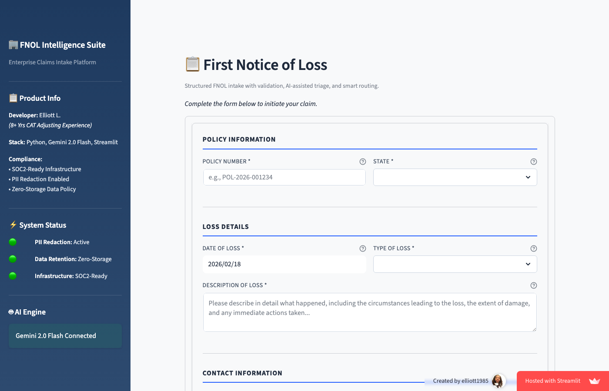
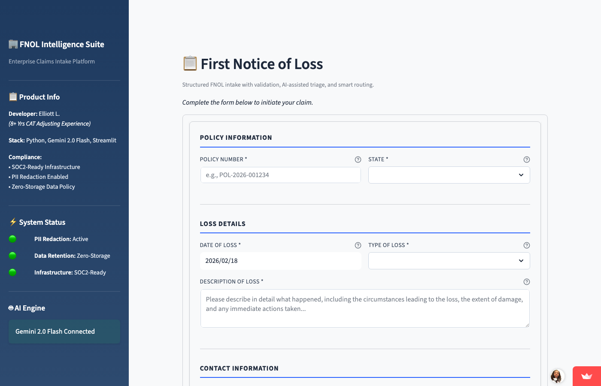
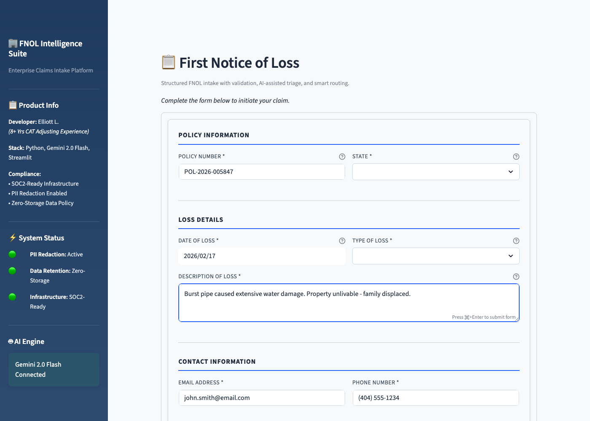
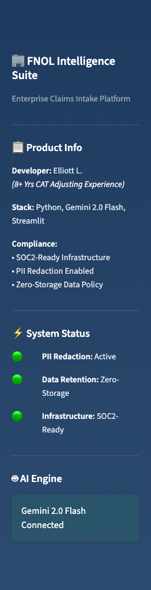

# FNOL Intelligence Suite  
Structured First Notice of Loss Intake & Intelligent Triage Platform

A workflow-driven First Notice of Loss (FNOL) intake system designed to standardize claim data capture, enforce validation logic, and prepare structured claim data for downstream automation and processing.

Built using Streamlit with AI-assisted triage powered by Google Gemini 2.0 Flash.

---

## Overview

The FNOL Intelligence Suite demonstrates how structured intake architecture improves data quality, reduces claim cycle time, and enables intelligent routing and risk detection at first notice.

The platform enforces required data validation, applies rule-based and AI-assisted triage logic, and prepares structured outputs ready for automation pipelines, claims systems, or analytics workflows.

Designed for:

- Insurtech carriers
- Claims operations teams
- Automation engineers
- Product and workflow architects

---

## Core Capabilities

### Structured Data Capture
- Policy number validation
- Date of loss validation with policy period checks
- Guided loss classification (Fire, Water, Hail, Wind, Theft)
- Detailed loss description capture
- Contact information normalization
- Photo and document upload support

### Validation & Logic Enforcement
- Required field enforcement
- Logical dependency validation
- Policy period verification
- Structured error handling and feedback

### AI-Assisted Triage (Gemini 2.0 Flash)
- SIU risk flag detection (vague timelines, vacancy, conflicting narratives)
- Subrogation opportunity detection (3rd-party liability indicators)
- ALE / total loss early severity recognition
- Intelligent claim classification support

### Smart Routing & Workflow Readiness
- State-based adjuster assignment logic
- Emergency housing protocol activation
- Structured claim receipt generation
- Automation-ready structured output

---

## Business Objective

Traditional FNOL processes often produce incomplete or inconsistent data, resulting in:

- Manual follow-up calls
- Increased claim handling time
- Delays in assignment
- Downstream rework

This platform demonstrates how intelligent intake validation and early triage can:

- Improve first-touch data accuracy
- Reduce intake-related errors
- Accelerate assignment decisions
- Enable automation across the claims lifecycle

---

## Live Demo

🚀 **[Try the Live Demo](https://elliott1985-fnol-intelligence-su-fnol-intelligence-suite-hp4xpe.streamlit.app)**

---

## Screenshots

| Intake Form | Validation | Triage Results | Routing Output |
|-------------|------------|----------------|----------------|
|  |  |  |  |

---

## Architecture

```
fnol_intelligence_suite.py     # Streamlit application entry point
validation/                    # Data validation logic
triage/                        # AI-assisted analysis logic
routing/                       # Adjuster assignment and workflow logic
utils/                         # Helper utilities
```

---

## Configuration

### Policy Period
Modify `POLICY_START_DATE` and `POLICY_END_DATE` to adjust effective period validation logic.

### State-to-Adjuster Mapping

```python
STATE_ADJUSTER_MAP = {
    "GA": "Sarah Mitchell",
    "FL": "Carlos Rodriguez",
    "TX": "Jennifer Thompson",
    "AL": "Michael Chen",
}
```

---

## Design Principles

- Structured intake-first architecture
- Validation-driven workflow control
- AI as enhancement, not replacement
- Automation-ready output formatting
- Compliance-conscious design

---

## Future Enhancements

- API integration with core claim systems
- Fraud risk pre-scoring dashboard
- Claim severity prediction module
- Automated adjuster workload balancing
- Structured audit logging

---

## License

Proprietary – All rights reserved.
